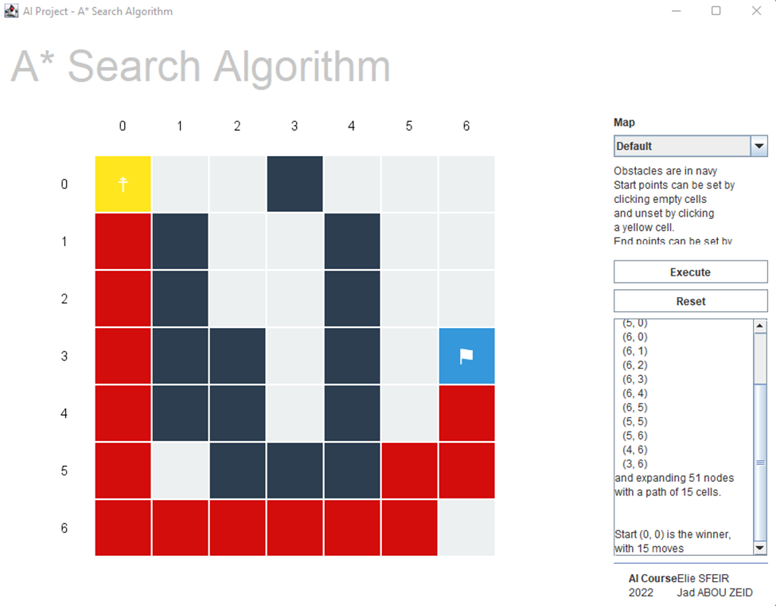
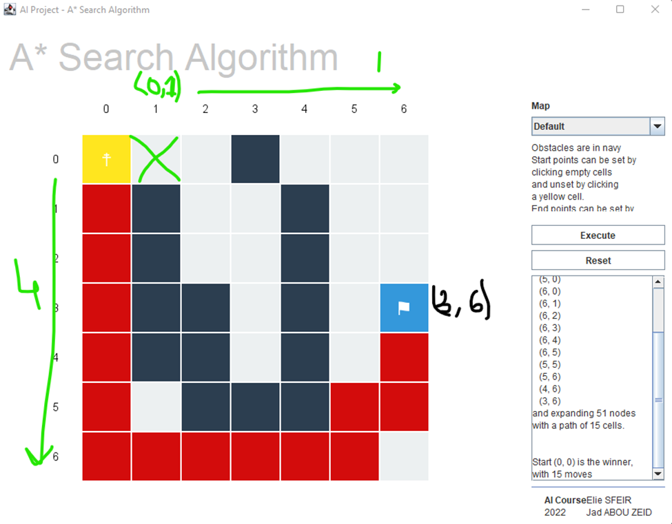
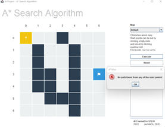
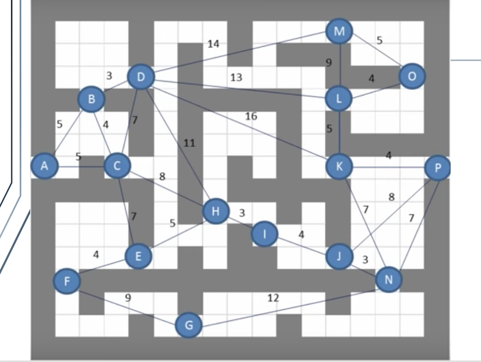
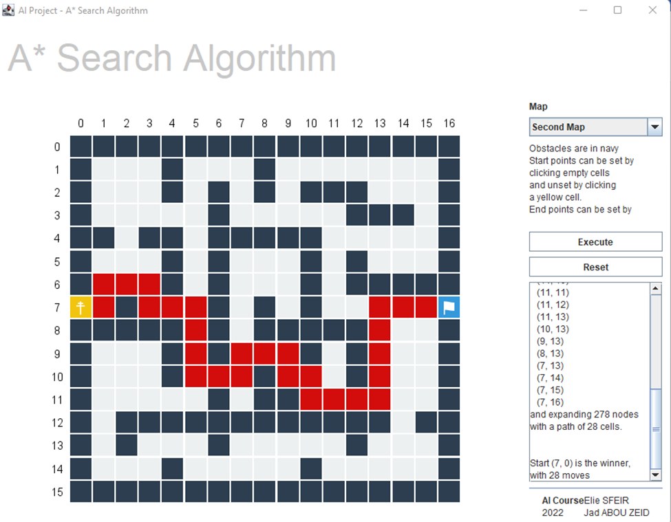

# A\* SEARCH ALGORITHM IN USER DEFINED MAZES

A* is an informed search algorithm, or a best-first search, meaning that it is formulated in terms of weighted graphs: starting from a specific starting node of a graph, it aims to find a path to the given goal node having the smallest cost (least distance travelled, shortest time, etc.). It does this by maintaining a tree of paths originating at the start node and extending those paths one edge at a time until its termination criterion is satisfied.

At each iteration of its main loop, A* needs to determine which of its paths to extend. It does so based on the cost of the path and an estimate of the cost required to extend the path all the way to the goal. Specifically, A* selects the path that minimizes

`f (n) = g (n) + h (n)`

## Heuristic Determination

In our case, the current heuristic that we will be using for our maze is the following:

_`h(x,y) = |x-targetX| + |y-targetY| + numObstacles(x) + numObstacles(y)`_

With the numObstacles being the number of obstacles in horizontal and vertical planes, for instance; in the example above:

The heuristic function at the first point (marked in green) is calculated as (keep in mind that x,y are inverted due to Java&#39;s Swing API): `h(1,0)=|1-3|+|0-6|+0+2=10`

Which then means that the f(x) function at that point is equal to `f(x)=10+0=10`

Why didn&#39;t we expand the second point to the right of our source? In fact, at that point;

Which then means that the f(x) function at that point is equal to , and that&#39;s why we expanded the first point. This algorithm keeps on running until:

- It expands all possible nodes.
- It reaches the end marked with a flag.

## Implementation and code explanation

The A* search algorithm is implemented in the MazeRunner class. In fact, it uses the Fibonacci Heap Sequence from jgrapht library in order to run. The algorithm starts from our start point, expands to the nearest 4 points (left, right, up, down); does all the necessary computations and appends it to our Heap Sequence. The path is then returned under a Point object (x,y) which references our 2D &#39;map&#39;. The GUI is built using IntelliJ Goodies, the following operations can be made by the user:

- Right-click to add an obstacle (wall), remove an obstacle by right clicking it again.
- Left-click to add a starting point, there can be numerous starting point and the algorithm will decide the best one to take to the sink (destination).
- Middle-click to move the destination around.

After these are done, execute the algorithm.

